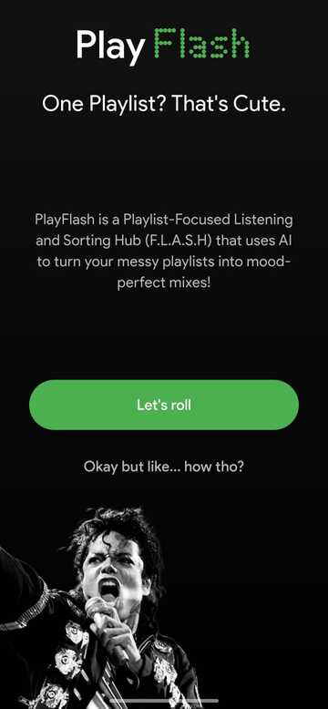

# PlayFlash 🎵

Tired of endlessly scrolling through messy Spotify playlists? **PlayFlash**  — 𝘗𝘭𝘢𝘺𝘭𝘪𝘴𝘵-𝘍𝘰𝘤𝘶𝘴𝘦𝘥 𝘓𝘪𝘴𝘵𝘦𝘯𝘪𝘯𝘨 𝘢𝘯𝘥 𝘚𝘰𝘳𝘵𝘪𝘯𝘨 𝘏𝘶𝘣 (𝘍.𝘓.𝘈.𝘚.𝘏) — is here to fix that. It's an AI-powered mobile app that organizes your music by mood and genre, making playlist discovery effortless.

PlayFlash connects to your Spotify account, analyzes your playlists, and automatically creates new, neatly categorized collections — saving you the hassle of manually sorting your songs, all in real time.

## 🚀 Features
- 🔐 Secure Spotify login with OAuth 2.0
- 📂 Fetches all user playlists from Spotify
- 🎶 Analyzes songs using Spotify Web API and Gemini AI
- 🧠 Categorizes songs by mood, genre, and vibe
- 🔄 Creates new, sorted playlists and adds them to your Spotify library
- 🖤 Clean Flutter UI designed for ease and speed

## 📸 Screenshots

###  Intro Screen


###  Authentication Screen


### Home Screen


### Processing Screen


### Creating mood based playlists


### Final Result Screen


## 🛠️ Tech Stack
- **Flutter & Dart** for cross-platform UI
- **Spotify Web API** for playlist and track data
- **OAuth 2.0** for Spotify login
- **Gemini API** for genre and mood analysis


## ⚠️ Important Limitation

- Due to recent changes in Spotify’s developer policy (effective May 15, 2025), all new apps that use Spotify services (like PlayFlash) are restricted to **Development Mode** by default.

## ❔ Why This Limitation Exists

- Spotify now grants Extended Quota Mode only to established organizations (those with 250k+ monthly active users), and not to individual developers like me :(

- Since PlayFlash is a personal project developed by a solo undergrad and not affiliated with any registered business entity, it does not currently meet Spotify’s criteria for extended quota access.

## 🚧 What This Means for You

- PlayFlash can currently be used by up to 25 users, whose Spotify emails I must manually add via the Spotify Developer Dashboard.

- This is **not** a bug or limitation of PlayFlash — it is a platform restriction imposed by Spotify from May 15, 2025.

- Once your Spotify account is added, PlayFlash will work as intended — fetching playlists and generating mood-based collections.

## 🔗 Learn More

- For full details on these restrictions, refer to Spotify’s official documentation:
- [📄 Visit Spotify's official documentation](https://developer.spotify.com/documentation/web-api/concepts/quota-modes)  


## 👶📱 Getting Started for Normal Users

- Send me your mail id connected to spotify via ashmercesletifercoc@gmail.com
- Download and install PlayFlash 
[⬇️ Download PlayFlash for Android](https://github.com/a5xwin/PlayFlash/releases/download/v1.0/playflash.apk)  
> _Tip: If prompted, allow installation from unknown sources._
- Enjoy!


## 🧑‍💻 Getting Started with Development (For Testers)

1. Clone the repository  
   ```bash
   git clone https://github.com/a5xwin/PlayFlash.git
   cd PlayFlash

2. Install dependencies
    ```bash
    flutter pub get

3. Rename the secrets_dummy.dart file (inside PlayFlash/lib/) to secrets.dart
    ```bash
    cd lib
    mv secrets_dummy.dart secrets.dart
    cd ..

4. Add your credentials
Open lib/secrets.dart and paste your:
- Gemini API Key
- Spotify Client ID
- Spotify Client Secret

You can obtain the last two from:
- https://developer.spotify.com/dashboard/create


5. Run the app
    ```bash
    flutter run


